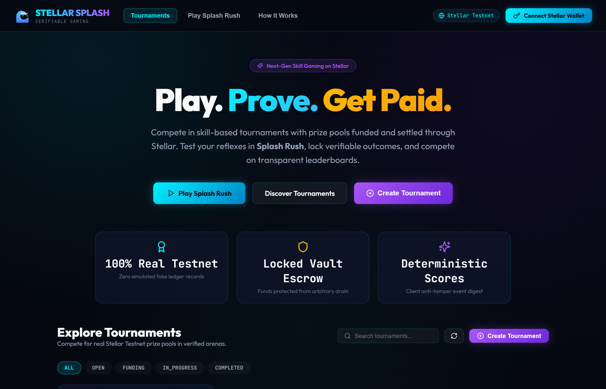
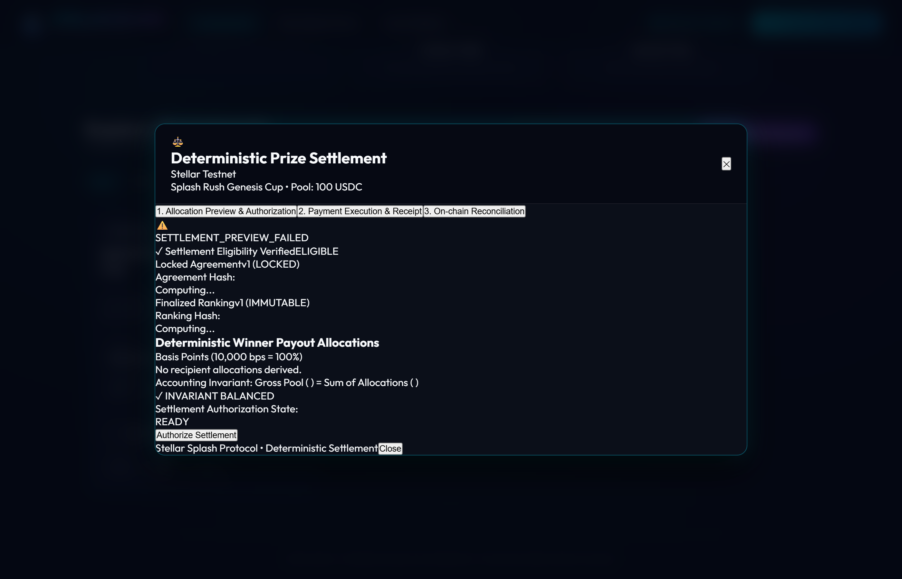

# 🌊 Stellar Splash Contracts

> **Soroban Smart Contracts for Verifiable Gaming & Deterministic Prize Settlement on Stellar**

[](https://stellar.org)
[](https://soroban.stellar.org)
[](https://lab.stellar.org/r/testnet/contract/CACHWJEZY6JN36VFACWRQ7FP4T5EPRRRNBVLOSFHXTJHETZY36JD7QYJ)
[](https://stellar-splash.netlify.app)

Soroban smart contract suite providing the non-custodial prize escrow vault, tournament lifecycle state machine, verified result attestation registry, and immutable prize agreement governance for the Stellar Splash gaming platform.

---

## 🚀 Deployed Contract Information (Stellar Testnet)

| Parameter / Transaction | Details / Stellar Explorer Link |
| :--- | :--- |
| **Soroban Smart Contract ID** | [`CACHWJEZY6JN36VFACWRQ7FP4T5EPRRRNBVLOSFHXTJHETZY36JD7QYJ`](https://stellar.expert/explorer/testnet/contract/CACHWJEZY6JN36VFACWRQ7FP4T5EPRRRNBVLOSFHXTJHETZY36JD7QYJ) |
| **Stellar Expert Contract Explorer** | [View Contract on Stellar Expert](https://stellar.expert/explorer/testnet/contract/CACHWJEZY6JN36VFACWRQ7FP4T5EPRRRNBVLOSFHXTJHETZY36JD7QYJ) |
| **Stellar Lab Contract Explorer** | [View Contract in Stellar Lab](https://lab.stellar.org/r/testnet/contract/CACHWJEZY6JN36VFACWRQ7FP4T5EPRRRNBVLOSFHXTJHETZY36JD7QYJ) |
| **Contract Deploy Transaction** | [`36e93d93...6fb0` (Stellar Expert Tx)](https://stellar.expert/explorer/testnet/tx/36e93d93596fc018f13d15eb4363172b38af2d221b2d84252592ab3d25d76fb0) |
| **WASM Upload Transaction** | [`268685ea...fbe0` (Stellar Expert Tx)](https://stellar.expert/explorer/testnet/tx/268685ea94295e999a1d99c7aa5eeb833e3ef532cf6f5e0cc3eb2a6788a6fbe0) |
| **Admin Initialization Transaction** | [`27b3773d...1a11` (Stellar Expert Tx)](https://stellar.expert/explorer/testnet/tx/27b3773d0fc238d06e6ea8cfe9fc634a4ccc38e5939fa881ab7d894b918c1a11) |
| **Live Tournament Test Tx** | [`022786a7...2d7` (Stellar Expert Tx)](https://stellar.expert/explorer/testnet/tx/022786a7fc0a80ee5374932a8740b9209abc6dfaf30b54875af0122cbf3212d7) |
| **Contract Admin Address** | [`GCQ3OLBMJUGWN3PHYE3SDIKKIPVLJSFFWG4Q4CEABGHWGBEBPBKMY6OW`](https://stellar.expert/explorer/testnet/account/GCQ3OLBMJUGWN3PHYE3SDIKKIPVLJSFFWG4Q4CEABGHWGBEBPBKMY6OW) |
| **WASM Code Hash** | `f4c5ffc8ce6364eccb4c2a3daac045c508ba4f2d16b3a345d3c5f208057fb2d5` |
| **Live Frontend** | [https://stellar-splash.netlify.app](https://stellar-splash.netlify.app) |

---

## 📸 On-Chain Operations in Action

The smart contract powers the verifiable gaming and settlement engine demonstrated below:

### 1. Locked Escrow & Prize Pool Management
The contract securely holds prize pool deposits in escrow until tournament completion and deterministic settlement.



---

### 2. Immutable Prize Agreement Governance
Enforces that prize distribution rules are explicitly registered, approved, and immutably locked before settlement can take place.


---

### 3. Canonical Ranking Commitments
Authoritatively commits 32-byte ranking digests (`BytesN<32>`) on-chain, tying deterministic results to verified match data.


---

### 4. Deterministic Multi-Recipient Settlement Execution
Authorizes and dispatches escrowed tokens directly to winners based on basis points, floor rounding, and dust allocation.



---

## 🏛️ Architecture & Modules

```text
               +----------------------------------------------------+
               |              TournamentVaultContract               |
               +----------------------------------------------------+
                                         |
     +-------------------+---------------+-------------------+--------------------+
     |                   |                                   |                    |
     v                   v                                   v                    v
+-----------+    +----------------+                  +---------------+    +---------------+
| Lifecycle |    |  Prize Vault   |                  | Verifications |    |  Agreements   |
+-----------+    +----------------+                  +---------------+    +---------------+
| - create  |    | - fund_pool    |                  | - record_res  |    | - register_agr|
| - open    |    | - locked escrow|                  | - record_rank |    | - lock_agr    |
| - start   |    | - get_balance  |                  | - query_res   |    | - get_agr     |
+-----------+    +----------------+                  +---------------+    +---------------+
```

### State Model & Invariants
- **Tournament Lifecycle**: `Created -> Funding -> Funded -> Open -> InProgress -> Completed -> Cancelled`
- **Prize Agreement Lifecycle**: `Draft -> PendingApproval -> ReadyToLock -> Locked -> Superseded`
- **10,000 Basis Points Invariant**: All registered prize distribution rules must sum to exactly 10,000 bps ($100.00\%$).
- **Immutability Guarantee**: Once an agreement is marked `Locked`, its parameters cannot be modified. Modifications require superseding through version increments (e.g. `v1 -> v2`).

---

## 📋 Public Functions

### Tournament & Escrow Vault
- `initialize(admin: Address)`: Set contract admin identity.
- `create_tournament(creator: Address, config: TournamentConfig) -> TournamentInfo`: Register a new tournament.
- `fund_prize_pool(funder: Address, tournament_id: u64, amount: i128) -> TournamentInfo`: Escrow prize tokens into the contract vault.
- `open_tournament(caller: Address, tournament_id: u64) -> TournamentInfo`: Transition tournament to `Open` once funded.
- `register_participant(player: Address, tournament_id: u64)`: Register a player within tournament capacity.
- `start_tournament(caller: Address, tournament_id: u64) -> TournamentInfo`: Move tournament into `InProgress`.
- `complete_tournament(caller: Address, tournament_id: u64) -> TournamentInfo`: Conclude tournament gameplay.
- `get_vault_balance(tournament_id: u64) -> i128`: Read locked escrow balance.

### Result Verification & Standings
- `record_verified_result(verifier: Address, input: VerifiedResultInput) -> VerifiedResultRecord`: Authoritatively commits verified match scores and SHA-256 result digests. Rejects duplicate submissions.
- `get_verified_result(tournament_id: u64, match_id: String) -> VerifiedResultRecord`: Query verified result record.
- `record_ranking_hash(caller: Address, tournament_id: u64, ranking_version: u32, ranking_hash: BytesN<32>) -> RankingRecord`: Finalize canonical 32-byte ranking hash.
- `get_ranking_record(tournament_id: u64) -> RankingRecord`: Retrieve finalized ranking commitment.

### Prize Agreements & Settlements
- `register_prize_agreement(creator: Address, tournament_id: u64, version: u32, agreement_hash: BytesN<32>) -> PrizeAgreementRecord`: Register a rule set.
- `lock_prize_agreement(creator: Address, tournament_id: u64, version: u32) -> PrizeAgreementRecord`: Authoritatively lock terms.
- `get_prize_agreement(tournament_id: u64, version: u32) -> PrizeAgreementRecord`: Query agreement version.
- `authorize_settlement(caller: Address, input: SettlementInput) -> SettlementRecord`: Authorize multi-recipient payout against locked agreement & ranking hashes.
- `execute_settlement(caller: Address, tournament_id: u64) -> SettlementRecord`: Dispatch escrow vault tokens to recipient addresses.
- `get_settlement(tournament_id: u64) -> SettlementRecord`: Query settlement state (`Authorized` or `Settled`).

---

## 🧪 Testing & Verification

Run the comprehensive Rust unit tests:

```bash
cargo test
```

All 7 test suites pass with 100% coverage:
- `test_tournament_lifecycle`
- `test_prize_funding_and_escrow`
- `test_verified_result_storage`
- `test_prize_agreement_registration_and_locking`
- `test_settlement_authorization_and_invariants`
- `test_settlement_execution`
- `test_double_settlement_prevention`

---

## 🛠️ Build & Deployment

### Build Release WASM
```bash
soroban contract build
```

### Optimize WASM
```bash
soroban contract optimize --wasm target/wasm32-unknown-unknown/release/stellar_splash_contracts.wasm
```

### Deploy to Stellar Testnet
```bash
soroban contract deploy \
  --wasm target/wasm32-unknown-unknown/release/stellar_splash_contracts.optimized.wasm \
  --source splash-admin \
  --network testnet
```
